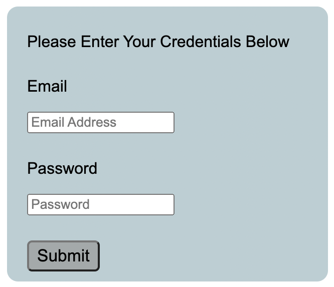
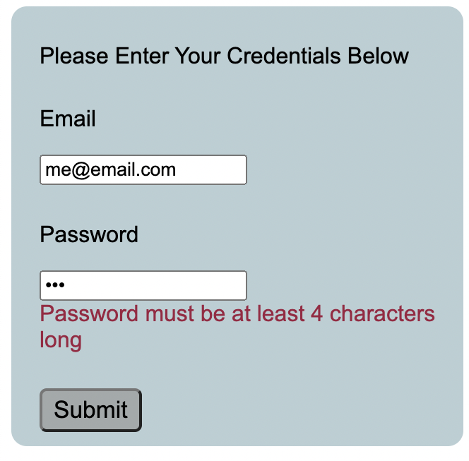

# Sign-In Form Created Using React and Formik

## This is a reusable React component with a built-in email and password validation

#### How to run: 
- clone this repository
- node modules are not included 
- from the command line, cd into the folder with the project
- npm i
- ng serve
- a folder named node_modules should appear with over 100 subfolders
- App.js is an importable component. Feel free to use it anywhere in your React app!

MIT License 
